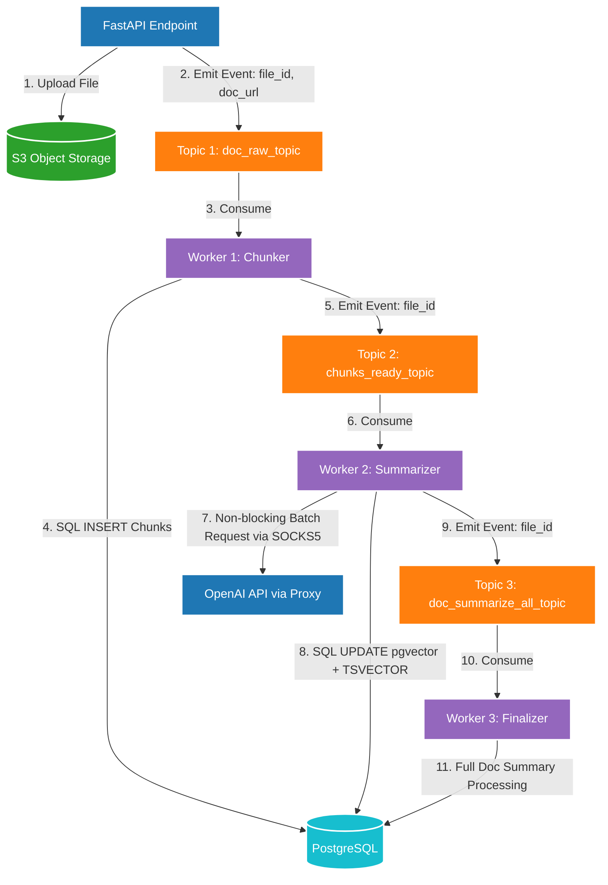

## Пример RAG пайплана для работы с PDF файлами

* Батчинг

* Саммаризация

* Гибридный поиск полнотектовый + векторный

## Архитектура распределенного RAG-пайплайна (Event-Driven Architecture)

Система спроектирована по канонам децентрализованных асинхронных Highload-платформ. Взаимодействие между изолированными микросервисами (воркерами) оркеструется через брокер сообщений Apache Kafka, что обеспечивает горизонтальное масштабирование и высокую отказоустойчивость контура (Fault Tolerance).

### Ключевые паттерны :
1. **Asynchronous Non-blocking Input:** FastAPI-эндпоинт разгружен на 100%. Он мгновенно сбрасывает тяжелый payload в S3, отправляет компактное событие в Kafka и возвращает клиенту ответ `HTTP 202 Accepted`, предотвращая таймауты сетевых шлюзов.
2. **Horizontal Scaling & Fault Tolerance:** Сервисы полностью изолированы. При пиковых нагрузках `Worker 2` (Summarizer) масштабируется независимо за счет увеличения количества партиций в Кафке. В случае отказа сетевого прокси, сообщения накапливаются в буфере брокера без потери данных.
3. **Highload-оптимизация СУБД:** Векторные эмбеддинги индексируются через `HNSW` индекс расширения `pgvector` для мгновенного расчета косинусного сходства. Лемматизация текстового саммари вынесена на уровень ядра СУБД через `Computed TSVECTOR` с `GIN` индексацией, реализуя сверхбыстрый гибридный поиск.

